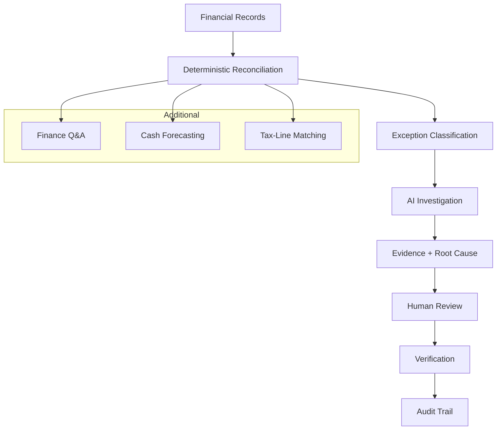

# FINCTRL-AI

## Live Demo - https://finctrl-ai.netlify.app
**FINCTRL‑AI** is an AI‑augmented finance‑controller platform that helps close finance‑operations loops by providing deterministic reconciliation, AI‑driven exception investigation, human‑in‑the‑loop review, grounded finance Q&A, cash‑forecasting, tax‑line matching, and full auditability.

---

## Problem

Finance teams often struggle with:
- **Fragmented financial records** across ledgers, bank statements, invoices, and tax records.
- **High‑volume reconciliation** effort to match transactions.
- **Unresolved exceptions** that require manual investigation.
- **Investigation overhead** causing delays and inconsistencies.
- **Need for reliable finance answers** (e.g., “What caused this discrepancy?”).
- **Human oversight** for high‑risk decisions such as refunds or tax adjustments.

---

## Solution

FINCTRL‑AI implements a deterministic‑first, AI‑enhanced workflow that turns raw financial data into actionable insights.



The platform also exposes dedicated APIs for **Finance Q&A**, **Cash Forecasting**, and **Tax‑Line Matching**.

---

## Key Features

### Deterministic Reconciliation
- Rule‑based matching engine with reason codes (e.g., `EXACT_MATCH`, `AMOUNT_MISMATCH`).
- Batch processing and per‑case endpoints.

### AI Investigation Agent
- Read‑only investigation state machine that gathers facts, validates evidence, determines root cause, and generates recommendations.
- Safety‑checked; never mutates financial data.

### Human‑in‑the‑Loop Review
- UI for reviewers to approve or reject AI recommendations.
- All actions are logged for audit.

### Finance Q&A
- Structured natural‑language interface that answers operational finance questions grounded in database records.
- Handles empty‑result and unsupported‑query cases gracefully.

### Cash Forecasting
- Deterministic, auditable cash‑flow forecast based on moving‑average baselines.
- Configurable look‑back and horizon, scenario weighting, confidence scoring, and risk indicators.
- An LLM may be invoked only to generate a natural‑language explanation of the forecast.

### Tax‑Line Matching
- Deterministic matching of invoices to tax records with tolerance handling for amount, tax‑rate, and taxable amount mismatches.
- Detailed result categories (exact match, rate mismatch, amount mismatch, etc.).

### Audit Trail
- Append‑only audit log that records every significant event (reconciliation result, investigation start, recommendation approval, etc.).

---

## Reconciliation Engine

The engine applies a deterministic set of rules to classify each transaction.  In the project's synthetic benchmark:
- **500 benchmark cases** were processed.
- **500/500 correctly classified** → **100 % accuracy**.
- **Macro F1 = 1.0**.
- Throughput of **≈257–275 cases/second** on the reference hardware.

These numbers reflect benchmark performance on the synthetic dataset bundled with the repository and are **not** production guarantees.

---

## AI Investigation Architecture

The investigation follows a state‑machine workflow implemented in the backend:
1. **Facts‑first investigation** – the agent queries read‑only data sources.
2. **Evidence gathering** – collects relevant records and computes supporting metrics.
3. **Validation** – ensures data consistency before proceeding.
4. **Root‑cause formation** – synthesizes a concise explanation.
5. **Recommendation generation** – suggests actions (e.g., “Escalate”, “Approve”).
6. **Safety checks** – blocks any action that would mutate financial state.
7. **Escalation/fallback** – low‑confidence or high‑risk cases are routed to human review.

The agent never performs write operations such as moving money or modifying invoices.

---

## Safety & Human‑in‑the‑Loop

FINCTRL‑AI is **read‑only** with respect to production financial data.  The following high‑risk actions are deliberately blocked:
- `MOVE_MONEY`
- `ISSUE_REFUND`
- `MODIFY_SETTLEMENT`
- `MODIFY_INVOICE`
- `MODIFY_TAX_RECORD`
- `MODIFY_PAYMENT`
- `ALTER_BANK_TRANSACTION`

When confidence is low or the scenario is high‑risk, the system requires human review.  Approved recommendations are **logged** in the audit trail rather than executed automatically.

---

## Finance Q&A

Supported question categories include:
- Transaction look‑ups
- Balance inquiries
- Reconciliation status
- Aggregated metrics (e.g., total cash‑out per day)

Answers are **grounded** in authoritative database records; the LLM is used only for natural‑language formatting of the response.  Unavailable data returns a clear *no‑data* response, and unsupported queries are rejected with a 400 error.

---

## Cash Forecasting

The deterministic forecast:
- Uses a **weighted moving‑average** of daily cash flows as a baseline.
- Allows configurable **look‑back** (default 30 days) and **forecast horizon** (default 7 days).
- Supports three scenarios: `BASELINE`, `CONSERVATIVE`, `OPTIMISTIC`.
- Calculates **confidence** and **risk** indicators based on recent volatility.
- An LLM may be invoked only to generate a natural‑language explanation of the forecast.

---

## Tax Matching

Invoices are matched to tax records using deterministic rules:
- **Amount tolerance** (± 0.01 %).
- **Tax‑rate normalization**.
- Classification outcomes: `EXACT_MATCH`, `RATE_MISMATCH`, `AMOUNT_MISMATCH`, `TAXABLE_AMOUNT_MISMATCH`, `CALCULATION_MISMATCH`, `MISSING_TAX_RECORD`, `DUPLICATE_TAX_RECORD`.

---

## Auditability

All actions are recorded in an **append‑only audit log**.  Events include:
- Reconciliation results
- Investigation start/completion
- Human review decisions
- Forecast generation
- Tax‑matching batch runs
- API accesses (read‑only)

The log can be queried via the `/api/audit` endpoints.

---

## Architecture

| Layer | Technology |
|-------|------------|
| Frontend | React + TypeScript + Vite |
| Backend | FastAPI + SQLAlchemy |
| Database | PostgreSQL |
| AI Integration | Gemini provider (read‑only) for explanation generation |

---

## Project Structure

```
FINCTRL-AI/
├─ backend/
│  ├─ app/
│  │  ├─ api/            # FastAPI routers (reconciliation, investigations, etc.)
│  │  ├─ agents/         # AI investigation controller & tools
│  │  ├─ core/           # Database session & settings
│  │  ├─ forecasting/    # Cash‑forecast controller & schemas
│  │  ├─ tax_matching/   # Tax‑matching controller & schemas
│  │  └─ ...
│  └─ requirements.txt
├─ frontend/
│  ├─ src/
│  │  ├─ pages/          # Dashboard, Reconciliation, Investigation, etc.
│  │  ├─ components/     # UI primitives (Card, ChartContainer, etc.)
│  │  └─ ...
│  └─ package.json
├─ data/                  # Synthetic datasets and benchmark scripts (future phases)
├─ evaluation/            # Placeholder for benchmark scripts
├─ .gitignore
├─ README.md              # <‑ this file
└─ ...
```

---

## Setup (Windows PowerShell)

### Backend
```powershell
cd backend
# Activate the existing virtual environment
.\.venv\Scripts\Activate.ps1
python -m pip install -r ..\requirements.txt
# Run the FastAPI server (default port 8000)
python -m uvicorn app.main:app --reload --port 8000
```

### Frontend
```powershell
cd frontend
npm install
npm run dev   # Vite dev server (http://localhost:5173)
```

> **Note:** A PostgreSQL instance must be configured according to `backend/app/core/database.py`.  No default credentials are shipped; configure the connection URL via environment variables as described in the code.

---

## API Documentation

When the backend is running, interactive OpenAPI docs are available at:
```
http://127.0.0.1:8000/docs
```

Key endpoints (all read‑only unless otherwise noted):
- **Reconciliation** – `/api/reconciliation/{case_id}` (GET), `/api/reconciliation/` (GET batch)
- **AI Investigations** – `/api/investigations/{case_id}` (POST to start, GET to retrieve)
- **Finance Q&A** – `/api/finance/qa/` (POST), `/api/finance/qa/{query_id}` (GET)
- **Cash Forecast** – `/api/forecast/cash/` (GET), `/api/forecast/cash/{forecast_id}` (GET)
- **Tax Matching** – `/api/tax-matching/` (GET batch), `/api/tax-matching/{invoice_id}` (GET single), `/api/tax-matching/results/{match_id}` (GET result)
- **Audit Trail** – `/api/audit/` (GET list), `/api/audit/{case_id}` (GET per case)

---

## Demo Flow
1. **Login** (demo credentials).
2. **Dashboard** – view KPI cards and navigation.
3. **Reconciliation** – inspect a case, see deterministic match status.
4. **Exception** – click on a mismatched case.
5. **Investigation** – trigger AI investigation, view evidence and root cause.
6. **Human Review** – approve or reject recommendation.
7. **Verification** – see updated status.
8. **Audit Trail** – browse immutable log for the case.
9. **Finance Q&A** – ask a question, receive a grounded answer.
10. **Cash Forecast** – request a forecast, view confidence and risk.
11. **Tax Matching** – run batch tax matching, inspect individual results.

---

## Evaluation

| Metric | Value |
|--------|-------|
| Benchmark cases | 500 |
| Correctly classified | 500 |
| Accuracy | 100 % |
| Macro F1 | 1.0 |
| Throughput | ~257–275 cases / second |

These results are obtained from the deterministic reconciliation benchmark using the synthetic dataset shipped with the repository.

---

## Limitations
- Uses a **synthetic dataset**; performance may differ on real production data.
- AI component is **read‑only**; no financial mutations are performed.
- Cash‑forecasting is deterministic; the LLM only formats explanations.
- Authentication is a simple demo placeholder; not suitable for production.
- In‑memory caches (e.g., forecast results) are not persisted across restarts.

---

## Future Scope
- Expand deterministic rules to cover more complex reconciliation scenarios.
- Integrate real‑world financial data sources (ledger systems, payment gateways).
- Add role‑based access control and production‑grade authentication.
- Implement write‑back capabilities behind a strict approval workflow.
- Enhance AI safety layers and expand the knowledge base for Finance Q&A.
- Provide CI/CD pipelines and containerised deployments.

---

*This README reflects the current state of the FINCTRL‑AI codebase as of the repository snapshot.*
